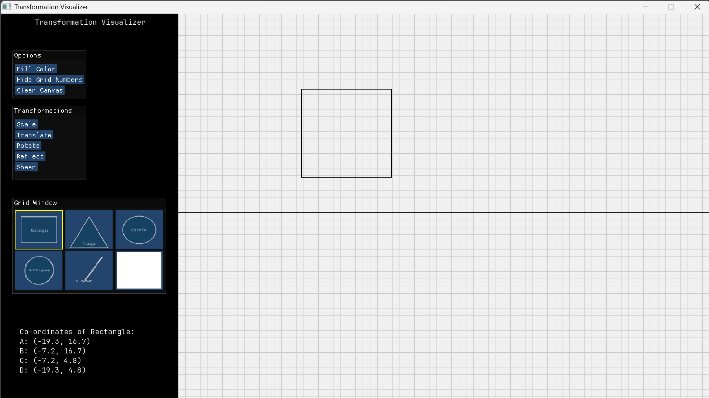
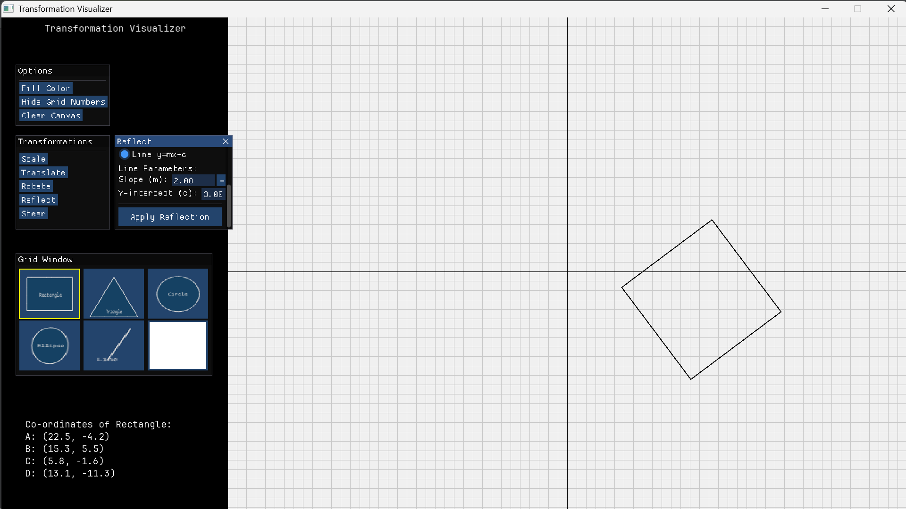

# Transformation Visualizer

Last Updated: 2025-02-20 18:41:11 (UTC)  
Author: saroj-2728, indeedSunil

## Overview
Transformation Visualizer is an interactive 2D graphics application that provides a visual understanding of geometric transformations. Built with SFML and ImGui, this tool allows users to create various shapes and apply transformations like translation, rotation, scaling, reflection, and shearing in real-time. The application features a split-panel interface with an interactive Cartesian coordinate system for drawing and a control panel for shape selection and transformation parameters. Using fundamental computer graphics algorithms like Bresenham's Line Drawing and Midpoint Circle Algorithm, it demonstrates both basic shape rendering and complex geometric transformations, making it an excellent tool for learning and visualizing 2D computer graphics concepts.

## Application Preview

*Main application interface showing the coordinate system and control panel with a rectangle shape in the coordinate system*


*Rectangle shape after being reflected about a line y = 2x + 3*


## Features
- Drawing basic shapes using algorithms:
  - Lines (Bresenham's Line Algorithm)
  - Circles (Midpoint Circle Algorithm)
  - Rectangles/Squares
  - Triangles
  - Ellipses
- Shape transformations:
  - Translation
  - Rotation
  - Scaling
  - Reflection
  - Shearing
- Interactive UI built with ImGui:
  - Shape selection panel
  - Transformation controls
  - Event handling for mouse interactions
- Split-panel interface:
  - Drawing area with coordinate system
  - Control panel for shape selection and transformations

## Prerequisites
- C++ compiler supporting C++17 or later
- SFML 3.0.0
- CMake 3.10 or later
- Eigen library
- Dear ImGui

> **Important Note for Windows Users:**
> When using SFML with MinGW, the compiler versions must match exactly. For SFML 3.0.0, use one of these specific MinGW distributions:
> - WinLibs UCRT 14.2.0 (32-bit)
> - WinLibs UCRT 14.2.0 (64-bit)
>
> Using other MinGW versions, even if they appear to have matching GCC versions, may not work correctly. For more details, see the [SFML download page](https://www.sfml-dev.org/download/sfml/3.0.0/).


## Building the Project
```bash
mkdir build
cd build
cmake ..
make
```

## Usage
1. Launch the application
2. Select a shape from the left panel menu
3. Click, hold, and drag on the graph area to create shapes:
  - Rectangle: Drag diagonally
  - Triangle: Drag to set size
  - Circle: Drag to set radius
  - Ellipse: Drag to set dimensions
  - Line: Drag to set endpoints
4. Use transformation controls to modify shapes

## Project Structure
```
.
├── CMakeLists.txt
├── src/
│   ├── Core/
│   │   ├── Core.cpp
│   │   └── Core.hpp
│   ├── UI/
│   │   ├── UI.cpp
│   │   └── UI.hpp
│   ├── Renderer/
│   │   ├── Renderer.cpp
│   │   └── Renderer.hpp
│   ├── Shapes/
│   │   ├── Shapes.cpp
│   │   ├── Shapes.hpp
│   ├── Transformations/
│   │   ├── Transformations.cpp
│   │   └── Transformations.hpp
│   ├── Matrix/
│   │   ├── Matrix.cpp
│   │   └── Matrix.hpp
│   ├── GUI/
│   │   ├── gui.cpp
│   │   └── gui.hpp
│   └── main.cpp
└── README.md
```

## Key Components
- main.cpp: Entry point for the application
- Core/: Core application logic and initialization
- Renderer/: Rendering and drawing functions
- Shapes/: Shape definitions and factory pattern implementation
- Transformation/: Matrix transformations and algorithms
- Matrix/: Custom matrix operations and Eigen integration
- UI/: ImGui interface management
- GUI/: SFML rendering and window management

## Contributing
1. Fork the repository
2. Create your feature branch (`git checkout -b feature/amazing-feature`)
3. Commit your changes (`git commit -m 'Add some amazing feature'`)
4. Push to the branch (`git push origin feature/amazing-feature`)
5. Open a Pull Request

## License
This project is licensed under the MIT License - see the LICENSE file for details